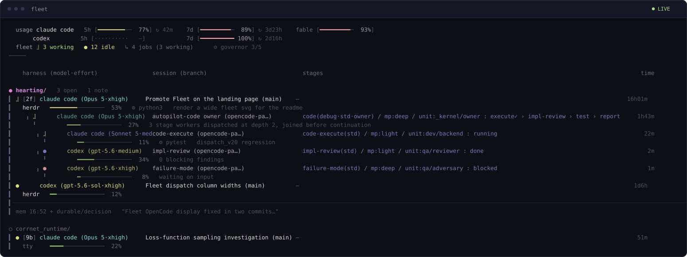

<h1 align="center">Hearting</h1>

<p align="center"><strong>One complete agent workflow across Claude Code, Codex, and OpenCode.</strong></p>

<p align="center">A local-first workflow layer for Claude Code, Codex, and OpenCode.</p>

<p align="center">
  
  
  
  
</p>

<p align="center"><strong>English</strong> · <a href="README.ko.md">한국어</a></p>

<p align="center"><a href="https://dmlguq456.github.io/hearting/"><strong>Landing page & agent map ↗</strong></a></p>

Hearting closes research, planning, implementation, and verification work
consistently across supported coding-agent runtimes. It is **not a setup for a
single runtime**. Shared contracts are defined once, then projected only onto
the native skill, agent, hook, mode, and command surfaces that each runtime
actually discovers.

```text
"Implement and test the login API, then leave a change report."
                                  ↓
       plan → execute → test → report + durable evidence
                                  ↓
              watch every stage of it live in `fleet`
```

## Why Hearting

- **Finish the whole cycle.** Research, specs, plans, implementation, tests,
  reports, and durable evidence stay connected.
- **Keep one contract across three runtimes.** Shared behavior is projected
  onto the surfaces Claude Code, Codex, and OpenCode actually discover.
- **Spend the right model on the right node.** Stage meaning and risk select
  the execution profile, sealed at route-compile time rather than passed as a
  trailing flag.
- **Watch the work while it runs.** `fleet` shows interactive sessions and
  dispatched workers from every runtime in one live tree.
- **Know what is running.** Inspect the active release or checkout, revision,
  freshness, duplicates, and required session action.
- **One activation, the whole harness.** Every runtime discovers the full
  manifest-derived capability set — no forked subsets or separate setups.
- **Carry decisions safely.** Durable memory and executable guards preserve
  conventions while checking spec, artifact, git, and projection boundaries.

## Quick start

### Requirements

- Python 3.10+
- `curl` or `wget`
- The CLI for each runtime you want to activate

### Install

```bash
curl -fsSL https://github.com/dmlguq456/hearting/releases/latest/download/install.sh | sh
~/.local/bin/hearting runtime doctor --runtime all --strict
```

The installer and distribution logic come from the same immutable Release tag;
that exact tag's SHA-256 integrity-checked archive is then installed. It activates
the full capability set for all three runtimes as immutable packaged bundles and
registers a daily user-level update check where the OS supports it. It does not
touch runtime credentials, sessions, logs, or databases.

When Codex is installed, the same transaction also installs a reversible
`$CODEX_HOME/.harness/bin/codex` protected ingress. Plain interactive `codex`, `codex resume`, and
`codex fork` enter the harness-managed App Server automatically; `codex exec`,
plugin administration, login, and other non-interactive commands pass through to
the recorded real CLI. Updates repair the launcher, and `hearting uninstall codex`
restores the exact previous command binding. Profile PATH edits require explicit
`--profile-policy manage` authority; otherwise use the printed manual source
instruction (the current terminal is not changed). `legacy-inplace-v1` is an
explicit degraded mode only. If Codex is not installed yet, this step is
reported as skipped and can be applied by a later runtime refresh.

Once `~/.local/bin` is on your `PATH`, manage it with:

```bash
hearting runtime status --runtime all
hearting update
hearting auto-update status
hearting runtime doctor --runtime all --strict

fleet          # live cross-harness dashboard; --once for a plain snapshot
```

The installer puts both `hearting` and `harness` on your `PATH` — the same
launcher under two names, so anything written against the old name keeps
working. It also drops `fleet` and the shared `compute-hosts` operator launcher
into `~/.local/bin`. The live
full-screen view needs `curses`; `fleet --once` and `fleet --json` do not, so
scripting and snapshots work anywhere Python does.

`compute-hosts` requires an explicit host choice and reads the user-owned
`${XDG_CONFIG_HOME:-$HOME/.config}/hearting/compute-hosts.yaml`. Install seeds
that file once as a fully commented template (two example hosts, English
comments) and never modifies it afterwards; until a host is filled in, the tool
and the Fleet panel report it as a template rather than failing. `harness
config status` lists every user-owned config file with its state and the
command that seeds it. The installer does not edit shell startup files,
schedule GPU work, or dispatch remote agents. Foreign PATH files
and symlinks are preserved; full uninstall removes only the owned shared link,
while a partial runtime uninstall retains it.

`auto-update status` also reports the installed release, channel, and live
scheduler health when Linux systemd-user or macOS LaunchAgent exposes it.
Unavailable probes are reported as unknown; unsupported platforms are reported
explicitly without changing the scheduler configuration. For a periodic
LaunchAgent, `active` means the job is loaded and scheduled; its updater process
does not need to remain running between triggers.

`hearting update` stages and verifies a new release before switching the active
pointer, and rolls back on failure. Existing agent sessions still follow their
runtime-specific re-invocation, new-session, or restart boundary; check
`runtime status` after an update.

The checksum sidecar detects transfer or asset corruption. Publisher
authenticity is anchored to the repository's GitHub Release and HTTPS account
boundary; it is not an independent signature.

To pin a version or disable scheduled checks:

```bash
curl -fsSL https://github.com/dmlguq456/hearting/releases/download/v2.0.0/install.sh | sh -s -- --no-auto-update
```

## Use natural language

You do not need to memorize command names. Describe the outcome and constraints
in your natural communication language. Runtime-native skills select the
relevant pipeline, and user-facing output follows the conversation, audience,
or artifact language instead of inheriting the language of this README.

> “Analyze this repository and create a PRD for the next feature.”

> “Implement and test the login API, then leave a change report.”

> “Review these papers and experiment code, then build a reproduction plan.”

> “Render the current screen, refine the design, and produce a development handoff.”

> “Find the previous decision and apply this project's existing naming convention.”

See [capabilities/README.md](capabilities/README.md) for every entrypoint and
[roles/README.md](roles/README.md) for the portable role model.

## See the whole fleet

`fleet` is a live view over the same attempt registry the dispatcher writes to,
so it shows interactive sessions and dispatched workers from all three runtimes
in one tree — not three dashboards you have to reconcile.

<p align="center">
  
</p>

Read the middle of that view top to bottom and you have the dispatch contract
in one picture. The bright row is a main session at depth 0. Under it, on the
rail, sits the owner it dispatched at depth 1 — carrying its sealed route,
`mp:deep`, and the stage pipeline with `execute` already ticked. Under that,
dimmer again, are the depth-2 stage workers that owner started: `code-execute`
on `mp:light` still running, `impl-review` done on a different harness,
`failure-mode` blocked and waiting. Depth reads as brightness, so a three-level
tree stays legible without a single connector line.

Each row carries the harness it runs on, the model profile its route sealed for
that node, how much context it has left, and how long it has been at it. A
stalled worker is visible as a worker rather than as a session that
mysteriously went quiet, and orphaned rows are surfaced instead of dropped.

The full-screen view needs `curses`. `fleet --once` prints a plain snapshot and
`fleet --json` emits the same state for scripting, so both work anywhere Python
does — including native Windows under Git Bash.

## What actually runs your request

One sentence in, a routed pipeline out. Routing, model selection, verification
depth, and evidence are the harness's job — and each decision is recorded
rather than improvised.

| Layer | What it does |
|---|---|
| **Routed capabilities** | 12 entry routers over 26 capabilities. Before material work the agent proposes a five-field route card — task, reason, route, scope, completion. You approve a filled-in proposal instead of recalling command names and flags. |
| **Intensity ladder** | `direct → quick → standard → strong → thorough → adversarial` selects the stage graph and dispatch depth. Verification rigor is derived from intensity rather than set on a separate axis, and token pressure can never downshift it. |
| **Sealed cross-harness dispatch** | At `standard+` each stage is a separately launched session with a sealed role, model profile, and disjoint write scope. Parallel groups of 2–4 legs start in exactly one transaction — a capacity shortage creates zero registry rows and zero model processes. Legs spread across harness families by default. Dispatch depth 3 is forbidden. |
| **Per-node model tiers** | `deep`, `balanced-deep`, `light`, and `mini` are distinct operating points, sealed per node at compile time. Adapters map them to concrete models; shared contracts never name a vendor model. |
| **Fleet** | A live dashboard over the same attempt registry: interactive sessions and dispatched workers from all three runtimes in one tree, each with state, harness, sealed profile, context gauge, and token accounting. Orphaned rows are surfaced, not dropped. |
| **Guards, not good intentions** | 39 hooks, 5 of them hard blocks. Write scope, spec read, artifact root, git state, and memory path are denied before the tool call, not flagged in review. A source edit with no compiled route for this working directory is refused — hotfix included. |
| **Fixed artifact system** | `research / analyze-project → spec → plans` for code and `research → draft → refine` for documents, under one project-wide `.agent_reports/` root. Each artifact has exactly one owning capability, and spec revisions snapshot the prior version. |
| **One memory store** | SQLite + FTS5 across every session, project, and runtime. Changed decisions are superseded rather than deleted, and handoffs stay pending until explicitly consumed. |

When a leg cannot start on its intended surface it degrades along a checked
chain — `same-harness-headless → cross-harness-headless → native-subagent →
inline` — preserving the route id, write scope, completion gate, and attempt
identity. The degradation is recorded with its failure class; it is never
silent.

The [landing page and agent map](https://dmlguq456.github.io/hearting/)
shows the same structure as a diagram.

## How it works

```text
                       harness-manifest.json
                        capability · role
                               │
             ┌─────────────────┼─────────────────┐
             │                 │                 │
      Claude Code native   Codex native    OpenCode native
      skills / agents      skills / agents  skills / agents
      hooks / commands     hooks / modes    commands / plugins
             └─────────────────┼─────────────────┘
                               │
              activate · status · refresh · doctor
```

| Layer | Responsibility |
|---|---|
| `core/` | Workflow, artifact, assurance, memory, and git/worktree contracts |
| `harness-manifest.json` | Canonical machine contract for capabilities, roles, and modes |
| `capabilities/`, `roles/` | Human-readable portable behavior sources |
| `adapters/` | Native projections and bridges for each runtime |
| `tools/install/` | Activation lifecycle that leaves runtime-owned state alone |
| `.agent_reports/` | Project artifacts for specs, plans, test evidence, and handoffs |

Immutable packaged releases or local snapshots are the default for users and
maintainers. `linked` remains an explicit live-debug mode: checkout changes
appear immediately on the discovery path, so it cannot guarantee one coherent
runtime generation for a long session. File visibility and instruction reload
are separate concerns, so `runtime status` reports whether each runtime needs a
re-invocation, new session, or restart through `session_action`.

## Runtime support

| Runtime | `linked` projection | `packaged` projection |
|---|---|---|
| Claude Code | Skills, agents, commands, and hooks | Immutable bundle of the same native surfaces |
| Codex | Skills, custom agents, modes, and hooks | Immutable bundle of the same native surfaces |
| OpenCode | Skills, agents, commands, and local guard plugin | Immutable bundle of the same native surfaces |

Runtime differences are reported rather than hidden. The installer marks
unsupported surfaces as `SKIP` with a reason, while credentials, sessions,
databases, logs, and foreign caches remain outside its ownership. See
[INSTALL_LAYOUT.md](INSTALL_LAYOUT.md) for the detailed mapping.

## Develop the harness

Maintainers build and activate a local immutable snapshot from a clean checkout:

```bash
git clone https://github.com/dmlguq456/hearting.git ~/hearting
cd ~/hearting
./tools/install/harness.sh runtime activate --runtime all
```

Use `--mode linked` only when intentionally debugging live projection behavior.
Updating the checkout does not activate a new snapshot; run `runtime refresh`
explicitly, and only new sessions use the new root.

Enable the repository's own Git hooks once per clone:

```bash
git config core.hooksPath tools/git-hooks
```

`pre-push` runs the same generated-projection check CI runs and refuses a push
that would fail it, so drift is caught before the commit is public and before
the release workflow tags it. `git push --no-verify` still bypasses it.

After changing a shared definition, refresh every generated projection and
check for drift:

```bash
python3 tools/generate.py
python3 tools/generate.py --check

./tools/generated-projections.test.sh
./tools/install/projection-completeness.test.sh
./tools/install/runtime-activation.test.sh
./tools/skill-conformance/check.sh
./tools/check-adaptation-boundary.sh
adapters/codex/bin/preflight.sh doctor
```

`tools/generate.py` is the single build/check entrypoint for every core
projection — runtime adapter metadata, the operator hub, and the published
landing surface included. Run the lifecycle suites from a clean working tree:
packaged activation deliberately refuses to build a bundle from a dirty repo.

Marketplace bundle generation is not part of this path. Humans own the root
README's value proposition and explanation; only machine contracts and runtime
projections are generated.

## Documentation

| Purpose | Document |
|---|---|
| Complete usage guide | [MANUAL.md](MANUAL.md) |
| Installation and runtime projections | [INSTALL_LAYOUT.md](INSTALL_LAYOUT.md) |
| Release criteria and SemVer automation | [RELEASE_POLICY.md](RELEASE_POLICY.md) |
| Capabilities and roles | [capabilities/README.md](capabilities/README.md), [roles/README.md](roles/README.md), [roles/MODES.md](roles/MODES.md) |
| Routing and artifacts | [core/WORKFLOW.md](core/WORKFLOW.md), [core/CONVENTIONS.md](core/CONVENTIONS.md) |
| Git, worktrees, and dispatch | [core/OPERATIONS.md](core/OPERATIONS.md) |
| Memory and recall | [core/MEMORY.md](core/MEMORY.md) |
| Hooks and design principles | [core/HOOKS.md](core/HOOKS.md), [core/DESIGN_PRINCIPLES.md](core/DESIGN_PRINCIPLES.md) |

## License

[MIT](LICENSE)
